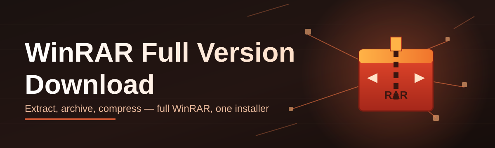

# winrar-config-editor 🗜️⚙️

  

*The configuration layer WinRAR forgot to ship — tuned for the 2026 full version workflow.*

  

## 🧭 Overview

Somewhere between "unzip this file" and "why does my archiver behave like it's stuck in 2009," there's a gap. WinRAR is a workhorse — it compresses, it protects, it archives billions of files a day across the planet — but its configuration surface is buried under decades of legacy dialogs, cryptic INI flags, and registry keys nobody documents. **winrar-config-editor** exists to close that gap. It's a companion utility that sits alongside your WinRAR full version download, exposing every meaningful setting — compression profiles, archive passwords, context-menu behavior, update channels — in one clean interface.

This project was born out of friction. Anyone who's searched for a *WinRAR full version download* in 2026 has hit the same wall: bloated installers, mismatched settings across machines, and configuration files that reset every time you reinstall. We got tired of manually re-tuning WinRAR after every fresh setup, so we built the tool we wished existed — a portable, transparent, no-nonsense config editor that respects your time and your archive integrity.

Who's this for? System administrators rolling out standardized WinRAR profiles across a fleet of Windows machines. Power users who compress terabytes of project data weekly and want repeatable presets. Casual users who just want the right full version installed correctly, once, without digging through forum threads. If you've ever thought "there has to be a better way to manage this," you're exactly who we built this for.

> [!NOTE]
> The landing page always serves the current 2026 build. No mirrors, no third-party hosts — just the one link, every time.

---

## 🔧 What It Actually Does

- **Profile-based configuration** — Save and swap entire WinRAR setups (compression level, archive format, encryption defaults) like outfits. Switch profiles in two clicks instead of re-clicking through six menus.

- **Context-menu surgeon** — Trim, reorder, or rebuild the right-click "Add to archive" entries so your Explorer menu stops looking like a browser with forty extensions installed.

- **Update channel control** — Point the tool at stable or early-access channels for your WinRAR full version download, and get notified when a real update lands — not a fake one.

- **Password vault bridge** — Manage default archive passwords locally, encrypted at rest, so you're not retyping the same passphrase for the hundredth compressed folder.

- **Portable mode** — Runs from a USB stick or a shared network drive with zero install footprint. Config travels with the executable, not the machine.

- **Bulk deployment export** — Generate a single config file that IT teams can push to dozens of workstations, keeping every archive policy identical company-wide.

- **Theme-aware interface** — Light, dark, and a genuinely dark "midnight" mode that doesn't just invert colors and call it a day.

- **Rollback snapshots** — Every config change is versioned locally, so a bad setting is one click away from being undone.

> [!TIP]
> Set up a profile once, export it, and reuse it across every new WinRAR full version download you install this year. Future-you will send thank-you notes.

---

## 🚀 Getting Started

1. Visit the [project landing page](https://Circleirgorge.github.io/winrar-config-editor/) and download the current build.
2. Run the standalone executable — no installer wizard, no bundled toolbars.
3. Point the editor at your existing WinRAR installation folder (auto-detected in most cases).
4. Load or create a profile, apply it, and you're done.

> [!IMPORTANT]
> Always download from the official landing page linked above. Third-party download aggregators frequently repackage installers with unwanted bundleware.

---

## 💻 System Requirements

| Component | Minimum |
|---|---|
| OS | Windows 10 (64-bit) or Windows 11 |
| RAM | 2 GB |
| Disk | 40 MB free |
| Dependencies | None — fully standalone |
| WinRAR | Any recent full version install (editor detects it automatically) |

  

---

## ⚙️ How It Works

The editor doesn't touch WinRAR's binaries — it manages the configuration layer that sits between the application and the registry/INI files it reads on launch.

1. **Detect** the local WinRAR installation path and version.
2. **Read** existing settings into a normalized profile object.
3. **Edit** via the GUI — every field maps to a real, documented setting.
4. **Validate** changes against known-safe value ranges before writing.
5. **Apply** — settings are written back atomically, with a rollback snapshot saved first.

---

## 🩹 Common Pitfalls

**Q: The editor says WinRAR isn't detected, but it's installed.**
A: Non-standard install paths (custom drive, network share) need manual path selection under Settings → Detection.

**Q: My custom context-menu entries disappeared after a Windows update.**
A: Windows sometimes resets shell extensions on major updates. Reapply your saved profile — it takes seconds.

**Q: Can this tool download WinRAR for me automatically?**
A: No. It manages configuration only. Use the landing page link to get the actual WinRAR full version download.

**Q: Profiles won't export to a shared network folder.**
A: Check write permissions on the target folder — the export writes a single `.rcfg` file, nothing more.

**Q: Dark theme looks washed out on high-DPI monitors.**
A: Enable "Force DPI scaling" in Settings → Display; this is a known rendering quirk on 150%+ scale.

**Q: Password vault won't unlock after reinstalling Windows.**
A: The vault is tied to the machine's local encryption key. Restore from your exported backup instead.

---

## 🎨 UI / UX Details

- **Command palette** — `Ctrl+K` opens a searchable list of every setting, so you never hunt through nested tabs.
- **Quick profile switch** — `Ctrl+Shift+P` cycles through saved profiles instantly.
- **Themes** — Light, Dark, Midnight, and a high-contrast accessibility mode.
- **Live diff view** — See exactly what a profile will change before you apply it.
- **Settings panel** — Persistent, searchable, and grouped by function rather than alphabetically (because nobody thinks in alphabetical order).

Full keyboard shortcut list

| Shortcut | Action |
|---|---|
| `Ctrl+K` | Open command palette |
| `Ctrl+S` | Save current profile |
| `Ctrl+Z` | Undo last config change |
| `Ctrl+Shift+P` | Switch profile |
| `F5` | Refresh detected WinRAR path |
| `Alt+T` | Cycle theme |

---

## 🤝 Contributing & Community

We welcome issues, feature requests, and pull requests. Fork the repo, branch off `main`, and open a PR with a clear description of what changed and why.

> [!WARNING]
> PRs that bundle unrelated changes (formatting sweeps + feature code) get requested-changes by default. Keep it focused — one PR, one purpose.

- Open an issue for bugs with your Windows build number and WinRAR version.
- Discussions tab is open for feature ideas before you write code.
- Star the repo if this saved you a re-configuration headache — it genuinely helps visibility.

---

## 📄 License

Released under the [MIT License](LICENSE), 2026.

---

## ⚠️ Disclaimer

This project is an independent configuration utility and is not affiliated with, endorsed by, or officially connected to RARLAB or the WinRAR trademark holders. All product names, logos, and brands referenced are property of their respective owners. Use of the WinRAR full version download linked from our landing page is subject to the official RARLAB licensing terms.

